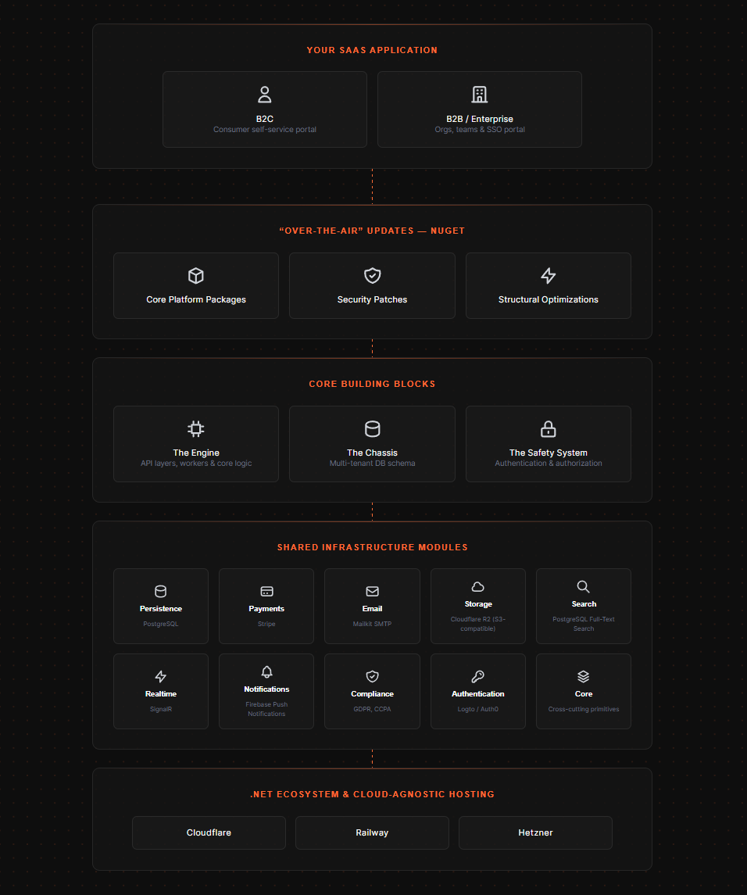
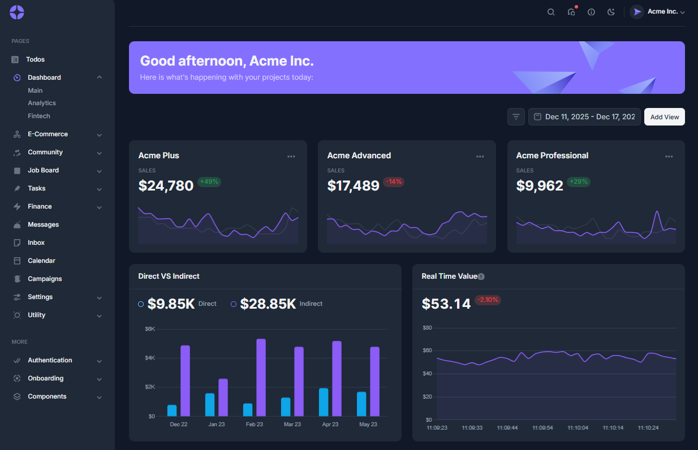

<h1 align="center">  🏗️ SaaS Factory </h1>

<h4> A comprehensive platform framework that combines opinionated architecture, production-ready infrastructure, and developer-friendly tooling to deploy enterprise-grade B2B/B2C SaaS applications in minutes instead of months.
 </h4>

<p align="center">
  
</p>

SaaS Factory is a **Platform Framework**, not a clone-and-forget boilerplate: the core ships as versioned **NuGet packages**, so you pull in bug fixes, security patches, and new features the way an EV receives over-the-air updates — without losing your application-specific customizations.

## ⚖️ SaaS Factory vs. Alternatives

| Framework / Platform | Ecosystem | Core Update Model | Architecture Philosophy | Infrastructure & Deployment |
| :--- | :--- | :--- | :--- | :--- |
| **SaaS Factory** | .NET (C#) | **Centralized NuGet Packages** (Dynamically updatable core platform) | Lightweight, pragmatic, Domain-Driven-Design (DDD), Clean Architecture and Laravel-inspired | Cloud-agnostic, cost-effective (.NET Aspire + YARP) |
| **ABP Framework** | .NET (C#) | **Centralized NuGet Packages** (Updatable framework layers) | Heavy Enterprise, strict Domain-Driven Design (DDD) | Highly abstract, enterprise-scale, steep learning curve |
| **Bullet Train** | Ruby on Rails | **RubyGems Packages** (Updatable via core framework gems) | "The Rails Way", extreme convention over configuration | Monolithic, optimized for maximum developer velocity |
| **Laravel Spark / Jetstream** | PHP | **Composer Packages** (Billing & Auth decoupled as packages) | Highly expressive, rapid application development | Traditional or serverless PHP, optimized for single-app instances |
| **SaaS Pegasus** | Python (Django) | **Boilerplate / Scaffolding** (One-time generation, manual upgrades) | Clean Django architecture, batteries included | Traditional Python stack, heavy emphasis on recent AI/LLM tooling |

Read the full [Vision & Positioning](docs/content/architecture/vision.md) doc for the automotive-factory metaphor behind the architecture, the reasoning for each design choice, and a deeper comparison against ABP, Bullet Train, Laravel Spark, and SaaS Pegasus.

---

 <h5 align="center">

<p> Database schema diagram for appblueprintdb </p>

[](https://azimutt.app/create?sql=https://raw.githubusercontent.com/saas-factory-labs/Saas-Factory/refs/heads/development/scripts/schema.sql)
[](docs/azimutt-database-analysis-report.md)



<a href="https://demo.saasfactorylabs.com">Visit the live demo site </a>

</h5>


## 🔢 Project Status

### CI/CD & Build Status

<!--[](https://github.com/saas-factory-labs/Saas-Factory/actions/workflows/sonarcloud-analysis.yaml?query=branch%3Amain) -->
[](https://github.com/saas-factory-labs/Saas-Factory/actions/workflows/azimutt-database-analysis.yml?query=branch%3Amain)
<!-- [](https://github.com/saas-factory-labs/Saas-Factory/actions/workflows/deploy-to-railway.yml?query=branch%3Amain) -->
<!-- [](https://github.com/saas-factory-labs/Saas-Factory/actions/workflows/docker-scout-vulnerability-scan.yml?query=branch%3Amain) -->
[](https://github.com/saas-factory-labs/Saas-Factory/actions/workflows/publish-nuget-packages.yml?query=branch%3Amain)

### GitHub Issues & Project Management

[](https://github.com/saas-factory-labs/Saas-Factory/issues?q=is%3Aissue+is%3Aopen+label%3Aenhancement)
[](https://github.com/saas-factory-labs/Saas-Factory/issues?q=is%3Aissue+is%3Aopen+label%3Abug)
[](https://github.com/saas-factory-labs/Saas-Factory/issues?q=is%3Aissue+is%3Aopen)

### Quality & security analysis

<!-- [](https://sonarcloud.io/summary/new_code?id=saas-factory-labs_Saas-Factory) -->
[](https://sonarcloud.io/component_measures?id=saas-factory-labs_Saas-Factory&metric=Security)
[](https://sonarcloud.io/component_measures?id=saas-factory-labs_Saas-Factory&metric=Reliability)
[](https://sonarcloud.io/component_measures?id=saas-factory-labs_Saas-Factory&metric=Maintainability)
[](https://sonarcloud.io/summary/new_code?id=saas-factory-labs_Saas-Factory)
[](https://sonarcloud.io/summary/new_code?id=saas-factory-labs_Saas-Factory)
[](https://sonarcloud.io/project/issues?id=saas-factory-labs_Saas-Factory&resolved=false&types=VULNERABILITY)
[](https://sonarcloud.io/component_measures?id=saas-factory-labs_Saas-Factory&metric=sqale_index)
[](https://sonarcloud.io/summary/new_code?id=saas-factory-labs_Saas-Factory)
<!-- [](https://sonarcloud.io/summary/new_code?id=saas-factory-labs_Saas-Factory) -->
[](https://github.com/saas-factory-labs/Saas-Factory/actions/workflows/codeql-analysis.yml)
<!-- [](https://github.com/saas-factory-labs/Saas-Factory/actions/workflows/snyk-analysis.yaml) -->
 <!-- [](https://sonarcloud.io/summary/new_code?id=saas-factory-labs_Saas-Factory) -->

## 📚 Documentation

- 🚀 **[Getting Started / Quick Start](docs/content/getting-started/Quick-start.md)** - Prerequisites, running the app, and day-to-day dev commands
- 🏗️ **[Vision & Positioning](docs/content/architecture/vision.md)** - Why the platform is built this way, and how it compares to alternatives
- 🗂️ **[Code Structure](docs/content/development/Code-Structure.md)** - Full repository and module breakdown
- 📝 **[Feature Development Guide](docs/content/development/Feature-Development-Guide.md)** - Adding domain entities, repositories, and API endpoints
- 🎯 **[Use Cases](docs/content/guides/Use-Cases.md)** - User flows and feature guides

## 🤝 Contributing

Contributions are highly welcome and much appreciated. See [CONTRIBUTING.md](docs/CONTRIBUTING.md) for how to get started, our commit message convention, and the [Code of Conduct](docs/CODE_OF_CONDUCT.md).

---

### 🛠️  Quick Start

```powershell
cd Code\AppBlueprint\AppBlueprint.AppHost
dotnet run
```

This starts the .NET Aspire AppHost, which orchestrates the Web, API, Gateway, and their dependencies (PostgreSQL, mail server, etc.) in Docker with a single command.

Requires the .NET 10 SDK, Docker, Node.js, and the GitHub CLI. Full prerequisite install steps for **Windows, macOS, and Linux** are in the [Quick Start guide](docs/content/getting-started/Quick-start.md).

# 🗂️ File structure in the git repository

SaaS-Factory is a [monorepo](https://en.wikipedia.org/wiki/Monorepo) hosting three deployable apps that share the platform core: **AppBlueprint** (the reusable SaaS blueprint itself), **DeploymentManager** (an internal tool that deploys and centrally manages every SaaS Factory-based app, and hosts their per-app admin portals as plugins), and **Landingpage** (the public marketing/landing site).

```bash
├─ .github            # GitHub workflows, CI/CD, and Copilot instructions
├─ build-artifacts    # Build output, logs, and temporary files (gitignored)
├─ docs               # Documentation site content, guides, and diagrams
├─ scripts            # Utility scripts (SQL setup/maintenance, PowerShell helpers)
├─ Code               # Application source code
│  ├─ AppBlueprint         # The reusable SaaS blueprint (product code)
│  ├─ DeploymentManager    # Internal tool: deploys/manages SaaS Factory apps and their admin portals
│  ├─ Landingpage          # Blazor WebAssembly marketing/landing page (static hosting)
│  ├─ Cloudflare-Workers   # Standalone Cloudflare Worker(s) (OpenAPI/Hono), independent of AppBlueprint
│  └─ SaaSFactory.Testing  # Cross-cutting test helpers (e.g. CodeQL test runner)
```

See the [full code structure breakdown](docs/content/development/Code-Structure.md) for the complete module tree, including all Shared-Modules and their NuGet packages.

<!--
## 👥 Maintainers

SaaS Factory is actively developed and maintained by:

<table>
  <tr>
    <td align="center">
      <a href="https://github.com/Trubador">
        <br />
        <sub><b>Casper Rubæk Mølvadgaard</b></sub>
      </a><br />
      Lead Architect & Primary Maintainer
    </td>
    <td align="center">
      <a href="https://github.com/hornvieh3u">
        <br />
        <sub><b>hornvieh3u</b></sub>
      </a><br />
      Contributor
    </td>
  </tr>
</table>
-->
