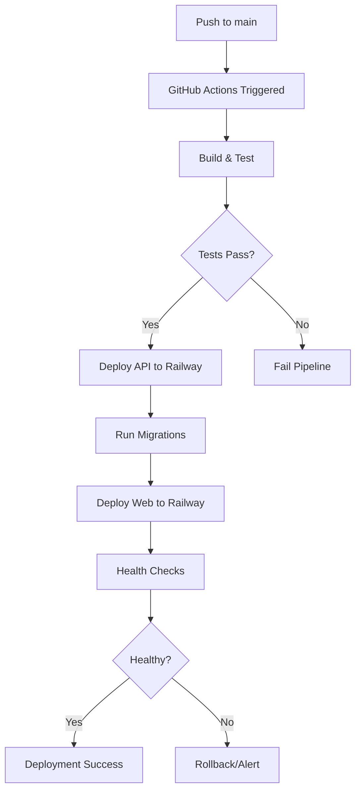

# Railway Deployment - Complete Implementation Overview

## 🎯 What Was Implemented

A complete Railway deployment solution for the AppBlueprint project with automated GitHub Actions workflow.

## 📦 Files Created (10 files)

### 1. GitHub Actions Workflow
```
.github/workflows/deploy-to-railway.yml
```
**Purpose**: Automated deployment pipeline for Railway
**Features**:
- Automatic staging deployment on push to main
- Manual production deployment with approval
- Build, test, and validation
- Database migrations
- Health checks
- Deployment notifications

### 2. Railway Configuration Files

#### Service Configuration
```
Code/AppBlueprint/railway.json
```
**Purpose**: Railway service configuration for API service
**Key Settings**:
- `RAILWAY_DOCKERFILE_PATH`: Points to correct Dockerfile
- Health check configuration
- Restart policies

#### Project Definition
```
Code/AppBlueprint/railway-project.json
```
**Purpose**: Multi-service project structure
**Defines**: API, Web, and PostgreSQL services with dependencies

#### Docker Compose Override
```
Code/AppBlueprint/docker-compose.railway.yml
```
**Purpose**: Railway-specific Docker Compose settings
**Features**: Dynamic PORT handling, health checks

#### Deployment Optimization
```
Code/AppBlueprint/.railwayignore
```
**Purpose**: Exclude unnecessary files from Railway deployments
**Benefits**: Faster builds, reduced storage

### 3. Documentation (4 files)

```
Code/AppBlueprint/RAILWAY_DEPLOYMENT.md
Code/AppBlueprint/RAILWAY_QUICKSTART.md
Code/AppBlueprint/RAILWAY_IMPLEMENTATION_SUMMARY.md
Code/AppBlueprint/RAILWAY_CHECKLIST.md
```

**Coverage**:
- Setup instructions
- Configuration guide
- Troubleshooting
- Best practices
- Checklists

### 4. Automation Script
```
Code/AppBlueprint/setup-railway.ps1
```
**Purpose**: Automate Railway setup process
**Features**:
- CLI installation
- Project initialization
- Environment creation
- Database setup
- Secrets generation

### 5. Commit Message Template
```
RAILWAY_COMMIT_MESSAGE.md
```
**Purpose**: Ready-to-use git commit message

## 🚀 How It Works

### Deployment Pipeline



### Key Components

#### 1. RAILWAY_DOCKERFILE_PATH
**Critical for multi-service deployments**
```bash
# In Railway environment variables:
RAILWAY_DOCKERFILE_PATH=AppBlueprint.ApiService/Dockerfile
```
This tells Railway which Dockerfile to use when multiple services exist in the same repository.

#### 2. Dynamic PORT Handling
```bash
ASPNETCORE_URLS=http://+:${PORT}
```
Railway assigns random ports; this ensures services listen on the correct port.

#### 3. Database Connection
```bash
DATABASE_CONNECTION_STRING=${DATABASE_URL}
```
Railway provides `DATABASE_URL` for managed PostgreSQL; this maps it to your app's expected variable.

## 📋 Setup Process

### Quick Start (5 steps)
1. **Run Setup Script**
   ```powershell
   cd Code\AppBlueprint
   .\setup-railway.ps1
   ```

2. **Add GitHub Secrets**
   - `RAILWAY_TOKEN_STAGING`
   - `RAILWAY_TOKEN_PRODUCTION`
   - `RAILWAY_DATABASE_URL_STAGING`
   - `RAILWAY_DATABASE_URL_PRODUCTION`

3. **Configure Railway Services**
   - Set `RAILWAY_DOCKERFILE_PATH` for each service
   - Configure environment variables
   - Link database to services

4. **Test Deployment**
   ```bash
   git push origin main
   ```

5. **Monitor & Verify**
   - Check GitHub Actions
   - Verify in Railway dashboard

## 🎛️ Deployment Options

### Option 1: Automatic (Staging)
**Trigger**: Push to `main` branch
**Process**: Fully automated
**Duration**: ~5-10 minutes

### Option 2: Manual (Production)
**Trigger**: GitHub Actions workflow dispatch
**Process**: Requires approval
**Duration**: ~5-10 minutes + approval time

### Option 3: CLI
**Trigger**: Manual command
```powershell
railway up --service api-service --environment staging
```

## 🔐 Security Features

1. **GitHub Secrets**: All tokens encrypted
2. **Environment Protection**: Manual approval for production
3. **Database Backups**: Before production migrations
4. **Token Rotation**: Documented in guides
5. **Environment Isolation**: Staging/production separated

## 💰 Cost Overview

| Component | Staging | Production |
|-----------|---------|------------|
| API Service | $5-10/mo | $20-30/mo |
| Web Service | $5-10/mo | $20-30/mo |
| PostgreSQL | $5/mo | $10/mo |
| **Total** | **$15-25/mo** | **$50-70/mo** |

*Costs vary based on usage, traffic, and resource consumption*

## 📊 Monitoring & Logs

### GitHub Actions
- Build logs
- Deployment progress
- Migration results
- Health check status

### Railway Dashboard
```
https://railway.app/dashboard
```
- Real-time logs
- Metrics
- Resource usage
- Deployment history

### CLI Monitoring
```powershell
railway logs --service api-service --environment staging
railway status
railway metrics
```

## 🔧 Troubleshooting Quick Reference

| Issue | Solution |
|-------|----------|
| Deployment failed | Check GitHub Actions logs, verify Railway tokens |
| Health check failing | Verify `/health` endpoint exists, check PORT binding |
| Database connection | Verify `DATABASE_URL` exists, check PostgreSQL status |
| Build errors | Test Docker build locally, verify Dockerfile path |
| High costs | Review resource usage, optimize queries, scale down |

## 📚 Documentation Structure

```
RAILWAY_DEPLOYMENT.md          → Comprehensive deployment guide
RAILWAY_QUICKSTART.md          → Quick start guide
RAILWAY_IMPLEMENTATION_SUMMARY.md → Technical details
RAILWAY_CHECKLIST.md           → Setup checklist
```

## 🎓 Learning Resources

- **Railway Docs**: https://docs.railway.app
- **Railway Discord**: https://discord.gg/railway
- **GitHub Actions**: https://docs.github.com/actions
- **Project Docs**: See files listed above

## ✅ Next Steps

### Immediate
1. [ ] Review all created files
2. [ ] Run `setup-railway.ps1`
3. [ ] Configure GitHub secrets
4. [ ] Test deployment to staging

### Short Term
1. [ ] Deploy to production
2. [ ] Set up custom domains
3. [ ] Configure monitoring alerts
4. [ ] Document custom configurations

### Long Term
1. [ ] Optimize resource usage
2. [ ] Implement database backups
3. [ ] Set up CI/CD enhancements
4. [ ] Review and update documentation

## 🤝 Team Collaboration

### For Developers
- Read `RAILWAY_QUICKSTART.md`
- Use automated staging deployments
- Monitor GitHub Actions

### For DevOps
- Read `RAILWAY_DEPLOYMENT.md`
- Manage production deployments
- Monitor costs and performance

### For Managers
- Read `RAILWAY_IMPLEMENTATION_SUMMARY.md`
- Review cost estimates
- Approve production deployments

## 🔄 Migration Path from Azure

1. **Preparation**
   - Export Azure PostgreSQL database
   - Document current configuration
   - Test Railway setup in parallel

2. **Migration**
   - Import database to Railway
   - Update GitHub secrets
   - Test deployment

3. **Cutover**
   - Update DNS records
   - Monitor closely
   - Verify all features

4. **Cleanup**
   - Decommission Azure resources
   - Update documentation
   - Notify stakeholders

## 📞 Support

- **Documentation Issues**: Create GitHub issue
- **Railway Issues**: Discord or Railway support
- **Deployment Issues**: Check logs, use troubleshooting guide

## 🎉 Success Criteria

✅ All files created successfully
✅ GitHub Actions workflow configured
✅ Railway configuration files in place
✅ Documentation complete
✅ Setup scripts ready
✅ Ready for deployment

---

**Implementation Date**: 2025-01-07
**Status**: ✅ Complete
**Next Action**: Run setup script and configure GitHub secrets

